# nyc taxi data pipeline

<br>

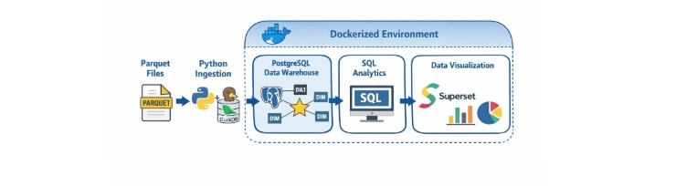
<br><br>

This project builds an end-to-end data pipeline using the public NYC Yellow Taxi dataset.The pipeline starts by downloading monthly Parquet files and ingesting them into PostgreSQL using a Python script and DuckDB. 

The raw data is then transformed and organized into a star-schema data warehouse with fact and dimension tables to support analytical queries. 

Finally, the processed data is explored through SQL analysis and visualized in interactive dashboards using Apache Superset.

The entire environment is containerized with Docker to ensure reproducibility and easy setup


### Table of contents

- [Data ingestion](#Data-ingestion)
- [Data warehouse](#Data-warehouse)
- [Data analytics](#Data-analytics)
- [Data visualization](#Data-visualization)

 

# Data ingestion

### Setting up the database

In a new terminal run the following command:

```
docker compose up -d
```

This command starts and runs the services defined in the docker-compose.yml file:

```yaml

services:
  pgdatabase:
    image: postgres:13
    environment:
      - POSTGRES_USER=root2
      - POSTGRES_PASSWORD=root2
      - POSTGRES_DB=ny_taxi
    volumes:
      - "./ny_taxi_postgres_data:/var/lib/postgresql/data:rw"
    ports:
      - "5433:5432"
  pgadmin:
    image: dpage/pgadmin4
    environment:
      - PGADMIN_DEFAULT_EMAIL=admin@admin.com
      - PGADMIN_DEFAULT_PASSWORD=root
    volumes:
      - "./data_pgadmin:/var/lib/pgadmin"
    ports:
      - "8080:80"
    depends_on:
      - pgdatabase  


  superset:
    image: apache/superset:3.1.1
    container_name: superset
    ports:
      - "8088:8088"
    environment:
      - SUPERSET_SECRET_KEY=mysecretkey
    volumes:
      - ./superset_home:/app/superset_home
    depends_on:
      - pgdatabase  
``` 

This Docker Compose file defines three services: a PostgreSQL database, a pgAdmin interface, and an Apache Superset instance.

* First, the pgdatabase service runs a **PostgreSQL** container using the postgres:13 image. It sets environment variables to define the database credentials (POSTGRES_USER, POSTGRES_PASSWORD) and the database name (POSTGRES_DB). The service maps a local folder (./ny_taxi_postgres_data) to PostgreSQL’s data directory (/var/lib/postgresql/data) so that the database data is persisted even if the container stops. It also maps port 5433 on the host to 5432 inside the container, allowing external tools to connect to the database. 

* Second, the pgadmin service runs **pgAdmin** (dpage/pgadmin4), which is a web-based interface for managing PostgreSQL databases. It sets the default login email and password through environment variables. A volume (./data_pgadmin) is used to persist pgAdmin configuration data. The service exposes port 8080 on the host, which maps to port 80 in the container, so the interface can be accessed from a browser. The depends_on field ensures that the PostgreSQL service starts before pgAdmin.

* Finally, the superset service runs **Apache Superset**, a business intelligence and data visualization tool, using the apache/superset:3.1.1 image. It exposes port 8088 so the Superset web interface can be accessed from the browser. The SUPERSET_SECRET_KEY environment variable is required for security and session management. A volume (./superset_home) is mounted to store Superset configuration and metadata so that dashboards and settings persist. The depends_on option ensures that Superset starts after the PostgreSQL database service.

Postgres Port mapping:

5432 → PostgreSQL port inside the container
5433 → Port on your computer. So you can connect from your machine using localhost:5433

Pgadmin Port mapping:

8080:80 → This means you can open pgAdmin in your browser at: http://localhost:8080

Superset Port mapping:

8088:8088 → This means you can open superset in your browser at: http://localhost:8088


### PgAdmin: Register Server

Go to http://localhost:8080/

* PGADMIN_DEFAULT_EMAIL=admin@admin.com
* PGADMIN_DEFAULT_PASSWORD=root

Right-click on servers and register server

<br>

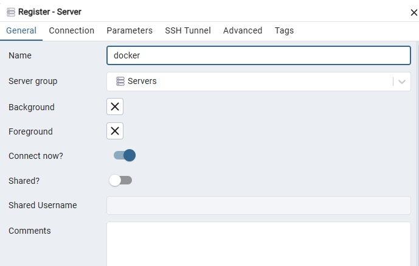
<br><br>

<br>

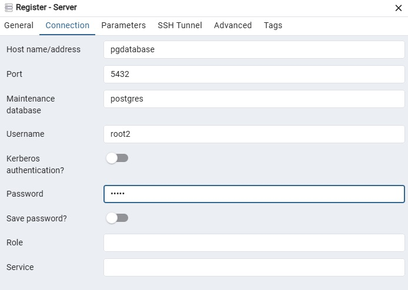
<br><br>

<br>

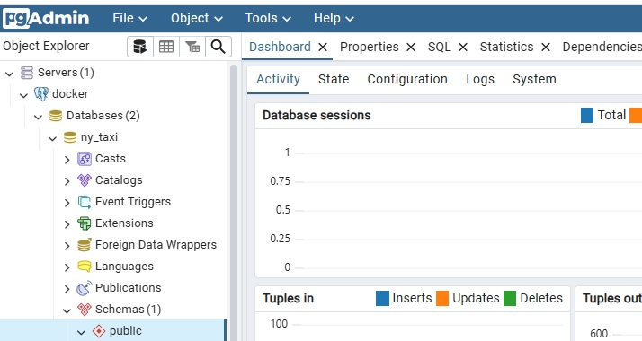
<br><br>


### Python script

```python

import duckdb

# Postgres conection

POSTGRES_CONN = """
host=localhost
port=5433
dbname=ny_taxi
user=root2
password=root2
"""

con = duckdb.connect()
con.execute("INSTALL postgres")
con.execute("LOAD postgres")

print("Connecting to Postgres")

con.execute(f"""
ATTACH '{POSTGRES_CONN}'
AS postgres_db (TYPE POSTGRES)
""")

print("Creating destination table if not exists")

# Create Schema Raw

con.execute("""
CREATE SCHEMA IF NOT EXISTS postgres_db.raw
""")


# Create table

con.execute("""
CREATE TABLE IF NOT EXISTS postgres_db.raw.taxi_trips_raw AS
SELECT * FROM read_parquet(
'https://d37ci6vzurychx.cloudfront.net/trip-data/green_tripdata_2019-01.parquet'
)
LIMIT 0
""")

# Insert taxi trips data

url = "https://d37ci6vzurychx.cloudfront.net/trip-data/green_tripdata_2019-01.parquet"

con.execute(f"""
    INSERT INTO postgres_db.raw.taxi_trips_raw
    SELECT *
    FROM read_parquet('{url}')
    """)

print("Taxi trips inserted")


# Taxi Zone Lookup Table 

zone_url = "https://d37ci6vzurychx.cloudfront.net/misc/taxi_zone_lookup.csv"

con.execute(f"""
CREATE TABLE IF NOT EXISTS postgres_db.raw.zone_lookup AS
SELECT *
FROM read_csv_auto('{zone_url}')
LIMIT 0
""")

# Insert zone data
con.execute(f"""
INSERT INTO postgres_db.raw.zone_lookup
SELECT *
FROM read_csv_auto('{zone_url}')
""")

print("Zone lookup inserted")

```


After running the command:

```
python ingest_data.py
```

This Python script uses DuckDB as an intermediary engine to download data from the internet and load it directly into a PostgreSQL database. First, the script defines a PostgreSQL connection string containing the necessary parameters to connect to the database, including the host, port, database name, user, and password. 

Next, the script installs and loads the Postgres extension for DuckDB using the commands INSTALL postgres and LOAD postgres. This extension allows DuckDB to connect to a PostgreSQL database and execute queries that read from or write to it. Then the script uses the ATTACH command to establish the connection to PostgreSQL using the previously defined connection string. Inside DuckDB, this attached database is referenced as postgres_db.

Once the connection is established, the script creates a schema called raw inside PostgreSQL. A raw schema is commonly used to store raw or unprocessed data, meaning the data is kept exactly as it was received from the original source before any transformations or cleaning are applied.

After that, the script creates a table called taxi_trips_raw inside the raw schema. To define the structure of this table, the script uses DuckDB’s read_parquet function to read a remote Parquet file containing New York green taxi trip data. The query includes LIMIT 0, which means the table is created with the same column structure as the file but without inserting any rows yet.

Once the table structure is created, the script proceeds to insert the actual trip data from the same Parquet file. This is done with an INSERT INTO ... SELECT * FROM read_parquet(url) statement. DuckDB reads the Parquet file directly from the URL and sends the resulting rows to the destination table in PostgreSQL.

Finally, the script performs a similar process for another table called zone_lookup. In this case, the data comes from a CSV file that contains information about taxi zones in New York City. 

<br>

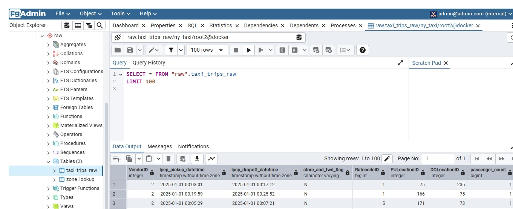
<br><br>


<br>

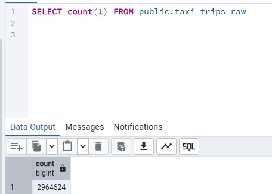
<br><br>


# Data warehouse

### Creating schemas

After running the command in PgAdmin:

```sql
CREATE SCHEMA staging;
```

```sql
CREATE SCHEMA dwh;
```


The command CREATE SCHEMA staging; creates a new schema called staging in the database. A schema is a logical container used to organize database objects such as tables, views, and indexes. The staging schema is commonly used to store intermediate data before it is cleaned or transformed.

The command CREATE SCHEMA dwh; creates another schema called dwh, which usually stands for Data Warehouse. This schema is typically used to store the final, structured tables that are optimized for analytics and reporting.

```
raw.taxi_trips_raw
        ↓
staging.trips
        ↓
dwh.dim_date
dwh.dim_location
dwh.dim_payment
        ↓
dwh.fact_trips
```


### Staging

After running the command in PgAdmin:

```sql
CREATE TABLE staging.trips AS
SELECT
    "VendorID",
    lpep_pickup_datetime,
    lpep_dropoff_datetime,
    passenger_count,
    trip_distance,
    "PULocationID",
    "DOLocationID",
    payment_type,
    fare_amount,
    tip_amount,
    total_amount
FROM raw.taxi_trips_raw
WHERE trip_distance > 0;
```

Creates a new table called staging.trips. Copies selected columns from raw.taxi_trips_raw. Filters out rows where the trip distance is not greater than zero

### Datawarehouse - Star Schema


* dim_date
* dim_location
* dim_payment
* fact_trips

### dim_date

```sql
CREATE TABLE dwh.dim_date AS
SELECT DISTINCT
    DATE(lpep_pickup_datetime) AS date,
    EXTRACT(YEAR FROM lpep_pickup_datetime) AS year,
    EXTRACT(MONTH FROM lpep_pickup_datetime) AS month,
    EXTRACT(DAY FROM lpep_pickup_datetime) AS day,
    EXTRACT(DOW FROM lpep_pickup_datetime) AS weekday
FROM staging.trips;
```

### dim_location

```sql
CREATE TABLE dwh.dim_location AS
WITH cte AS 

	(SELECT DISTINCT
	    "PULocationID" AS location_id
	FROM staging.trips
	UNION
	SELECT DISTINCT
	    "DOLocationID"
	FROM staging.trips)

select 
	cte.location_id, 
	zone_lookup."Borough",
	zone_lookup."Zone",
	zone_lookup."service_zone"


FROM cte LEFT JOIN raw.zone_lookup
ON cte.location_id = zone_lookup."LocationID";
```

<br>

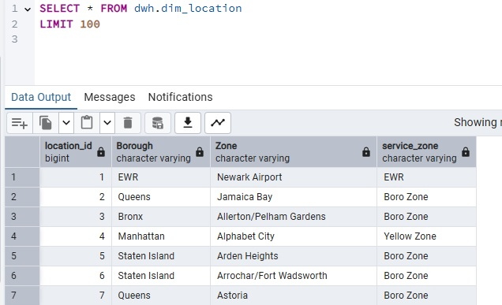
<br><br>

### dim_payment

```sql
CREATE TABLE dwh.dim_payment AS
SELECT DISTINCT
    payment_type,
    CASE 
        WHEN payment_type = 1 THEN 'Credit card'
        WHEN payment_type = 2 THEN 'Cash'
        WHEN payment_type = 3 THEN 'No charge'
        WHEN payment_type = 4 THEN 'Dispute'
        WHEN payment_type = 5 THEN 'Unknown'
        WHEN payment_type = 6 THEN 'Voided trip'
        ELSE 'Other'
    END AS description
FROM staging.trips;
```

<br>

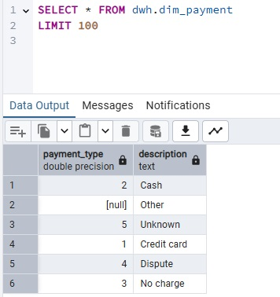
<br><br>

### fact_trips

```sql
CREATE TABLE dwh.fact_trips AS
SELECT
    DATE(lpep_pickup_datetime) AS date,
    "PULocationID" AS pickup_location_id,
    "DOLocationID" AS dropoff_location_id,
    payment_type,
    passenger_count,
    trip_distance,
    fare_amount,
    tip_amount,
    total_amount
FROM staging.trips;
```

<br>

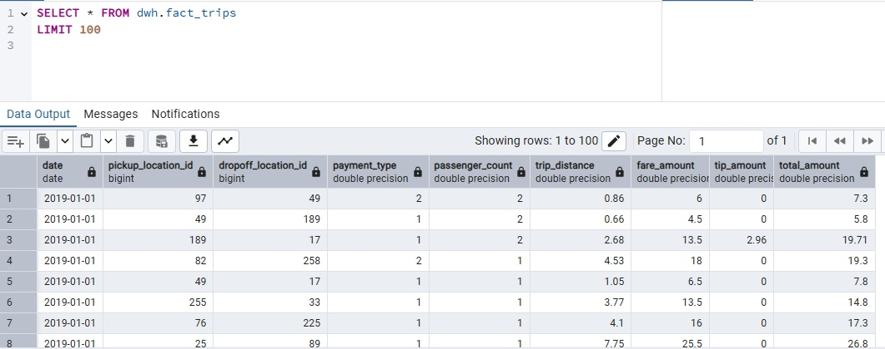
<br><br>

# Data analytics

### Total trips, distance and revenue

```sql
SELECT
    COUNT(*) AS total_trips,
    ROUND(SUM(trip_distance)::numeric,2) AS total_distance,
    ROUND(SUM(total_amount)::numeric,2) AS total_revenue,
    ROUND(AVG(total_amount)::numeric,2) AS avg_trip_revenue
FROM dwh.fact_trips;
```

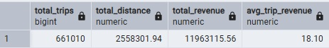


### Revenue by payment type

```sql
SELECT
    dp.description AS payment_type,
    COUNT(*) AS trips,
    ROUND(SUM(f.total_amount)::numeric,2) AS revenue
FROM dwh.fact_trips f
JOIN dwh.dim_payment dp
ON f.payment_type = dp.payment_type
GROUP BY dp.description
ORDER BY revenue DESC;
```

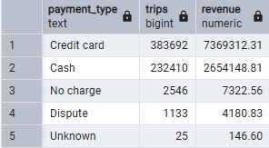

### Top areas within each borough

```sql
SELECT *
FROM (
    SELECT
        dl."Borough",
        dl."Zone",
        COUNT(*) AS trips,
        RANK() OVER (
            PARTITION BY dl."Borough"
            ORDER BY COUNT(*) DESC
        ) AS rank_in_borough
    FROM dwh.fact_trips f
    JOIN dwh.dim_location dl
    ON f.pickup_location_id = dl.location_id
    GROUP BY dl."Borough", dl."Zone"
) t
WHERE rank_in_borough <= 3;
```

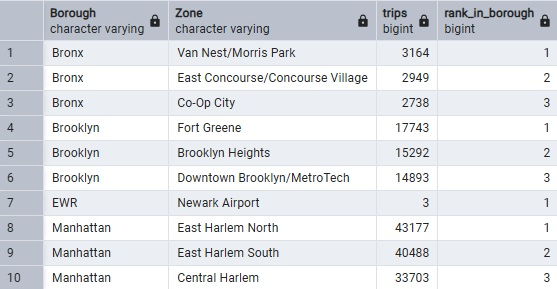


### Trips with abnormally high tips

```sql
WITH tip_stats AS (
    SELECT
        AVG(tip_amount) AS avg_tip,
        STDDEV(tip_amount) AS std_tip
    FROM dwh.fact_trips
)
SELECT
    f.trip_distance,
    f.total_amount,
    f.tip_amount
FROM dwh.fact_trips f
CROSS JOIN tip_stats s
WHERE f.tip_amount > s.avg_tip + 2 * s.std_tip
ORDER BY f.tip_amount DESC
LIMIT 5;
```

This query identifies outlier trips with unusually high tips by using a statistical rule based on the mean and standard deviation of all tips. First, the CTE calculates the average tip and the standard deviation. Then, a CROSS JOIN attaches these global statistics to every trip so each row can be compared against them. The WHERE clause filters trips where the tip is greater than the average plus two standard deviations

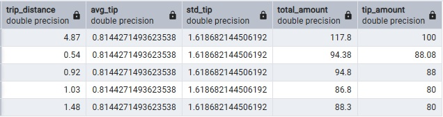


### Borough's share of total revenue

```sql
WITH revenue_by_borough AS (
    SELECT
        dl."Borough",
        SUM(f.total_amount) AS revenue
    FROM dwh.fact_trips f
    JOIN dwh.dim_location dl
        ON f.pickup_location_id = dl.location_id
    GROUP BY dl."Borough"
),
total_revenue AS (
    SELECT SUM(total_amount) AS total
    FROM dwh.fact_trips
)

SELECT
    r."Borough",
    r.revenue,
    ROUND(
        (100.0 * r.revenue / t.total)::numeric,
        2
    ) AS revenue_share_percent
FROM revenue_by_borough r
CROSS JOIN total_revenue t
ORDER BY r.revenue DESC;
```


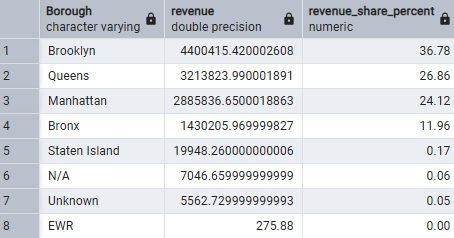


# Data visualization

Apache Superset is an open-source business intelligence and data visualization platform used to explore and analyze data. It allows users to connect to many types of databases, run SQL queries, and create interactive dashboards and charts without needing to build a custom analytics application.

In a new terminal run the following command:
```
docker exec -it superset bash
```

Then run in order to create admin user:

```
superset fab create-admin
```

Then run:

```
superset db upgrade
superset init
```

### Database connection

Settings → Database Connections → + Database → PostgreSQL

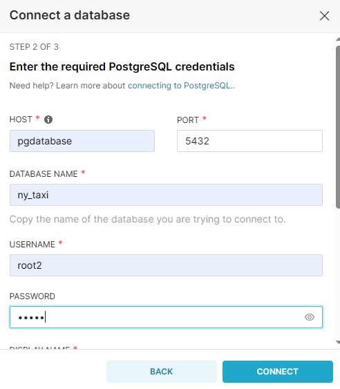


### Create dataset 

In Apache Superset the flow is always like this:

Database → Dataset → Chart → Dashboard

So, in order to create the dashboard, we must first create the dataset.

datasets → + dataset → Select database, schema and table → Create dataset and create chart

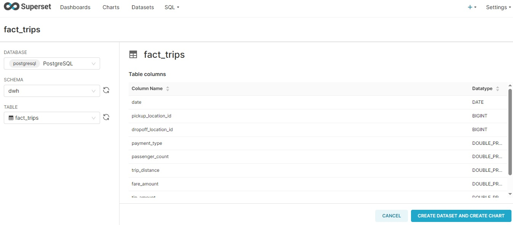

### Create chart: Total trips

Select big number chart → metric: count(*) → SAVE

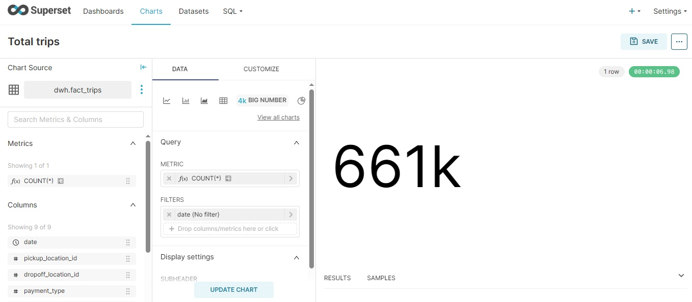

### Add chart to dashboard

dashboards → + dashboard

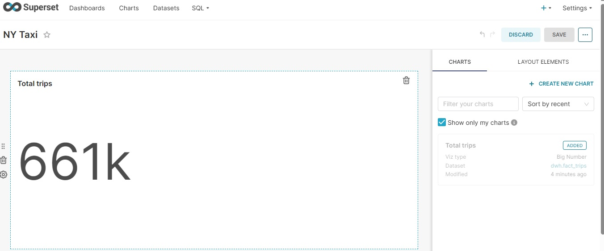


### Create chart: Amount of trips per day

Chart source: dwh.fact_trips
Line Chart
x-axis: date
Metrics: COUNT(*)

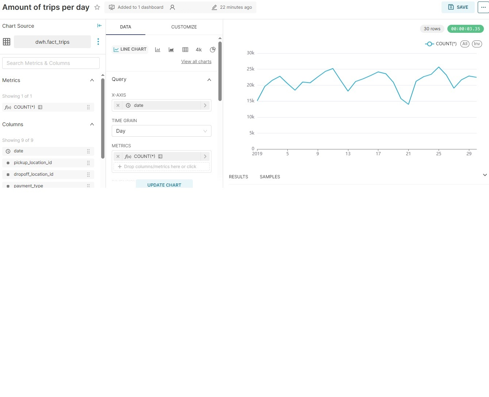

### Create chart: Trips per pickup zone

First we must create a new dataset called "zones" which will consist of the fact_trips table and enriched with dim_location with this query:

```sql

SELECT
    dl."Zone",
    COUNT(*) AS trips
FROM dwh.fact_trips ft
JOIN dwh.dim_location dl
ON ft.pickup_location_id = dl.location_id
GROUP BY dl."Zone"
ORDER BY trips DESC
LIMIT 10;
```

save new dataset as "zones"

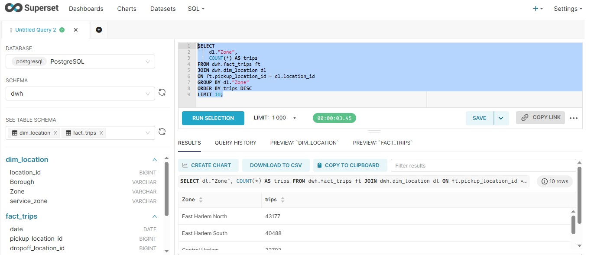


Chart source: dwh.zones
Bar Chart
Y-axis: zone
Metrics: SUM(trips)

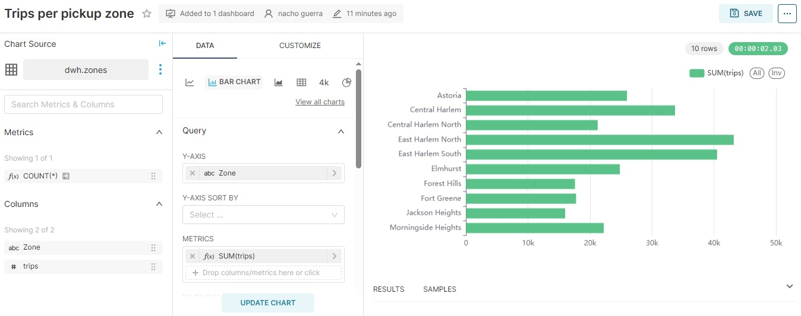


### Final dashboard

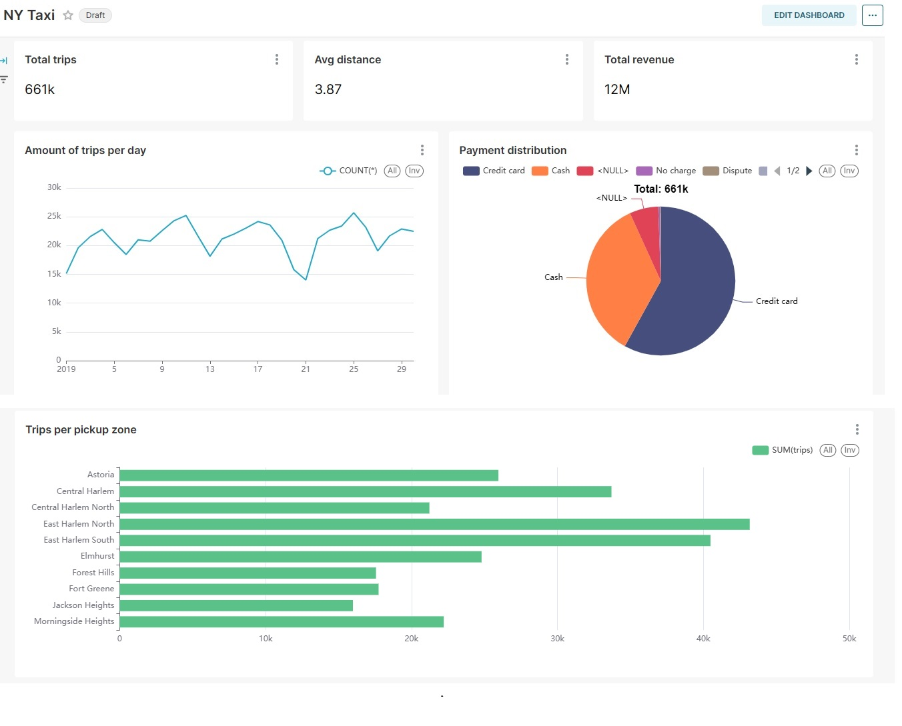